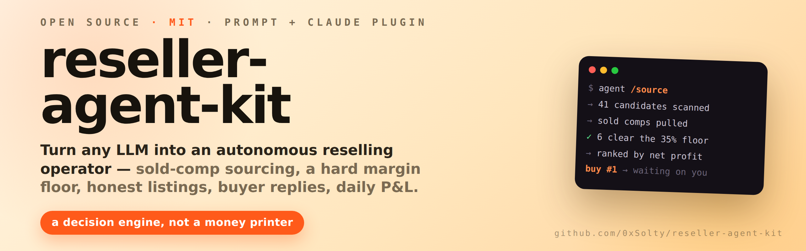
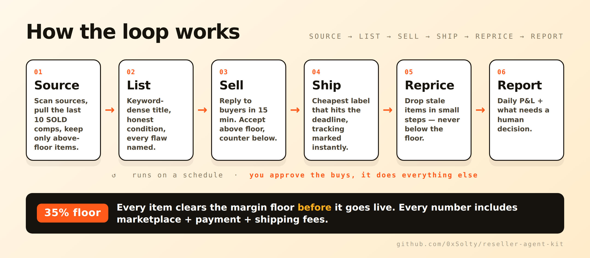

<p align="center">
  
</p>

<p align="center">
  <a href="LICENSE"></a>
  
  
  
</p>

# reseller-agent-kit

A system prompt + Claude plugin that turns any capable LLM into an **autonomous reseller operator** — one that only buys against real sold comps, keeps a hard margin floor, lists honestly, answers buyers, and reports daily.

It's a **decision engine, not a money printer.** It does the research, pricing, copy, and comms. You still make the buys it approves and hand the box to the carrier. No fake reviews, no faked condition, no "passive income" fantasy.

> The whole point: an agent that says *"skip it, the comps don't clear the floor"* far more often than it says *"buy."* That discipline is the edge.

## Contents

- [How the loop works](#how-the-loop-works)
- [Quickstart](#quickstart)
- [What a run looks like](#what-a-run-looks-like)
- [The rules it will not break](#the-rules-it-will-not-break)
- [What it can't do (on purpose)](#what-it-cant-do-on-purpose)
- [What's in here](#whats-in-here)
- [FAQ](#faq)
- [Roadmap](#roadmap)
- [License](#license)

## How the loop works

<p align="center">
  
</p>

## Quickstart

### Option A — Raw prompt (fastest, any model)

1. Copy all of [`SYSTEM_PROMPT.md`](SYSTEM_PROMPT.md).
2. Paste it into the model's **system prompt** / **custom instructions** (a ChatGPT Project's instructions, a Grok workspace prompt, a Claude Project).
3. Send your first message:

```
Budget: $300 to start.
Categories I can ship: small electronics, headphones, retro games.
Margin floor: 35% net after fees.
Sign-off required on any single buy over $80.
Run Phase 1.
```

### Option B — Claude plugin (adds /source, /list, /report)

```bash
git clone https://github.com/0xSolty/reseller-agent-kit.git
```

In Claude Code:

```
/plugin marketplace add ./reseller-agent-kit
/plugin install reseller-agent-kit
```

Full setup in [`INSTRUCTIONS.md`](INSTRUCTIONS.md).

## What a run looks like

You run `/source` with a batch of candidates and it hands back a ranked shortlist — with the losers killed and the reason why:

```
ITEM                     BUY    SOLD MED   FEES+SHIP   NET     MARGIN   VERDICT
Sony WH-1000XM4          $88    $174       $34         $52     37%      ✅ BUY  (rank 1)
GoPro HERO 12            $145   $235       $41         $49     34%      ⚠️ skip — under floor
Mechanical keyboard      $42    $96        $22         $32     43%      ✅ BUY  (rank 2)
Lego Star Wars (used)    $60    $88        $19         $9      12%      ❌ skip — thin margin
RTX 3070                 $210   $265       $46         $9      4%       ❌ skip — slow sell-through

→ 2 clear the floor. Recommend buying the keyboard first: highest margin + fastest comps.
→ Nothing else is worth your cash today.
```

Then `/list` turns an approved item into a full, honest listing, and `/report` gives you the daily P&L. It never spends — you make the buy.

## The rules it will not break

| Rule | What it means |
|------|---------------|
| **No blind buys** | Nothing gets sourced without sold comps showing margin above the floor. |
| **Margin floor** | Skips anything under 35% net *after* fees and shipping. |
| **Sold comps only** | Prices against SOLD listings, never asking prices. |
| **Fees in every number** | Marketplace + payment + shipping, always. |
| **Honesty** | Every flaw named. No stock photos passed off as the real item. |
| **Approval gates** | Never spends, refunds, or accepts a return over your limit without a yes. |

## What it can't do (on purpose)

- It doesn't touch your money or your account — it recommends, **you** execute.
- It can't hand the box to the carrier.
- It won't invent comps, conditions, or numbers to make a deal look good.

That's the feature, not the limitation. An agent you can trust with a store is one that can't quietly do the dangerous stuff.

## What's in here

| File | What it is |
|------|-----------|
| [`SYSTEM_PROMPT.md`](SYSTEM_PROMPT.md) | The full operator prompt. Paste into Grok / GPT / Claude and go. |
| [`skills/reseller/SKILL.md`](skills/reseller/SKILL.md) | Same logic as a Claude plugin skill. |
| [`commands/`](commands/) | Slash commands: `/source`, `/list`, `/report`. |
| [`.claude-plugin/plugin.json`](.claude-plugin/plugin.json) | Plugin manifest so it installs as a plugin. |
| [`INSTRUCTIONS.md`](INSTRUCTIONS.md) | 2-minute setup for both paths. |

## FAQ

**Does it connect to eBay / my store automatically?**
No — and that's deliberate. It works from the comp data and item details you give it, and produces the buy calls, listings, replies, and reports. You keep the keys.

**Will it make me money on its own?**
No. It removes the two things that kill resellers — bad buys and slow, sloppy listings — and enforces a margin floor. The profit still comes from you sourcing and shipping. It's a sharper operator, not a faucet.

**Which model should I use?**
Any strong one (Grok, GPT, Claude). Give it real sold-comp numbers and it works from facts, not vibes.

**Can I change the margin floor / categories / limits?**
Yes — you set all of them in Phase 1. 35% is just the default.

## Roadmap

- [ ] Optional comp-fetcher script (paste a URL → sold-comp median)
- [ ] CSV in / CSV out for bulk sourcing
- [ ] More marketplace fee presets

PRs and issues welcome.

## License

MIT — do whatever you want with it. Built by [@0xSolty](https://x.com/0xSolty).
